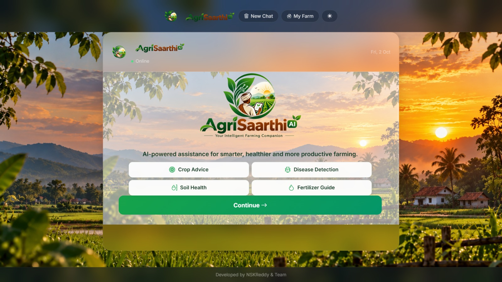
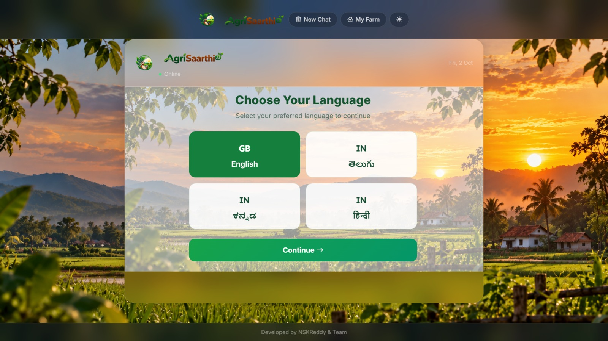
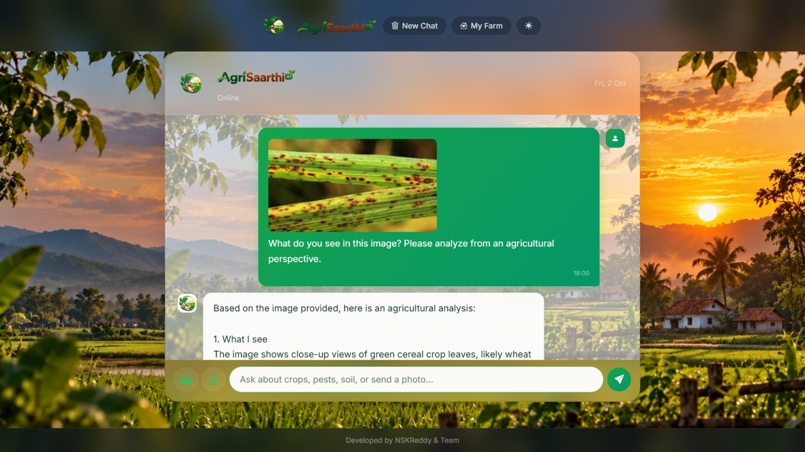
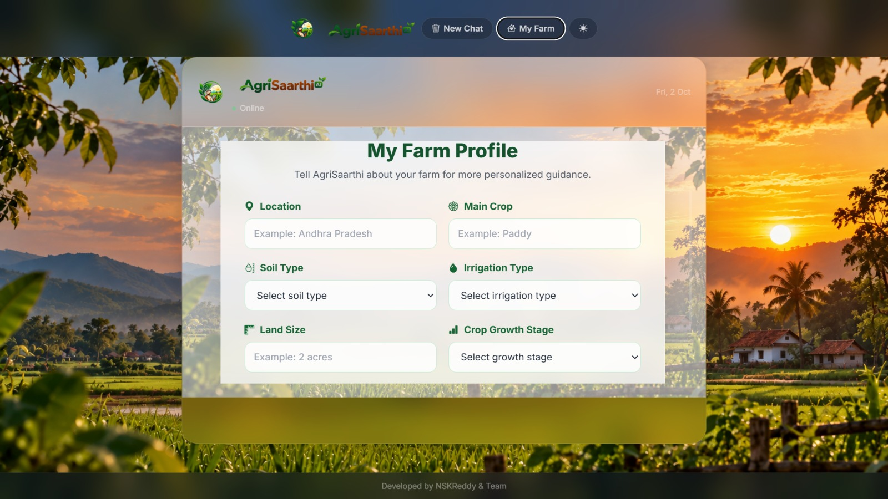

<div align="center">

# 🌱 AgriSaarthi AI

### Your Intelligent Farming Companion

[](https://python.org)
[](https://flask.palletsprojects.com)
[](https://console.groq.com)
[](LICENSE)
[](https://docs.astral.sh/uv/)

**AI-powered assistance for smarter, healthier and more productive farming.**

</div>

---

## 🌾 About AgriSaarthi AI

**AgriSaarthi AI** is an AI-powered agriculture assistant designed to help farmers get practical farming guidance through a simple and user-friendly interface.

The system can answer agriculture-related questions, analyze crop images, provide personalized suggestions based on a farmer's saved farm profile, and support multiple Indian languages.

AgriSaarthi AI is a **customized and extended version of an open-source agriculture assistant project**, with additional features, redesigned interface, personalized farm context, and project-specific modifications.

---

## ✨ Features

| Feature | Description |
|---------|-------------|
| 💬 **AI Text Chat** | Ask agriculture-related questions and receive AI-generated responses |
| 🌿 **Crop Advice** | Get guidance related to crops, cultivation and crop management |
| 🩺 **Disease Detection** | Upload a crop image and get AI-based disease analysis |
| 🎙️ **Voice Input** | Ask questions using voice input |
| 🔊 **Voice Output** | Receive AI responses with optional voice output |
| 🌐 **Multilingual Support** | Supports English, Telugu, Kannada and Hindi |
| 👨‍🌾 **My Farm Profile** | Save location, crop, soil, irrigation, land size and growth stage |
| 🧠 **Personalized Responses** | Uses saved farm information as context when answering relevant questions |
| 💾 **Conversation Memory** | Maintains conversation context using Redis with an in-memory fallback |
| 🌱 **Quick Farming Options** | Quick access to Crop Advice, Disease Detection, Soil Health and Fertilizer Guide |
| 🌓 **Light/Dark Theme** | User-friendly interface with theme support |
| 📱 **Responsive Interface** | Designed for convenient use across different screen sizes |

---

## 🖥️ User Interface

### 🏠 Welcome Screen

The AgriSaarthi AI welcome screen provides quick access to common farming assistance:

- Crop Advice
- Disease Detection
- Soil Health
- Fertilizer Guide

<p align="center">
  
</p>

### 🌐 Language Selection

Users can select their preferred language:

- 🇬🇧 English
- 🇮🇳 Telugu
- 🇮🇳 Kannada
- 🇮🇳 Hindi

<p align="center">
  
</p>

### 💬 AI Chat

Users can communicate with AgriSaarthi AI through text, image and voice-based interaction.

<p align="center">
  
</p>


## 👨‍🌾 My Farm Profile

AgriSaarthi AI includes a **My Farm Profile** feature that allows farmers to save important farm information.

The profile includes:

- 📍 Location
- 🌱 Main Crop
- 🪨 Soil Type
- 💧 Irrigation Type
- 📐 Land Size
- 🌾 Crop Growth Stage


<p align="center">
  
</p>

The saved information can be provided to the AI as supporting context when answering relevant questions.

### Example

```text
Location: Tirupati
Main Crop: Tomato
Soil Type: Red Soil
Irrigation: Drip Irrigation
Land Size: 2 acres
Growth Stage: Flowering
```
---

## 🧠 How It Works

```text
                    👨‍🌾 Farmer
                        │
                        ▼
              ┌───────────────────┐
              │   AgriSaarthi AI  │
              │     Interface     │
              └───────────────────┘
                        │
          ┌─────────────┼─────────────┐
          ▼             ▼             ▼
       💬 Text        🖼️ Image       🎙️ Voice
          │             │             │
          └─────────────┼─────────────┘
                        ▼
              ┌───────────────────┐
              │   Flask Backend   │
              └───────────────────┘
                        │
                        ▼
              ┌───────────────────┐
              │    Groq Models    │
              │   LLM + Vision    │
              └───────────────────┘
                        │
                        ▼
              🌱 AI Agriculture
                  Assistance
                        │
                        ▼
              👨‍🌾 Farmer Response
              ```

              ---

## 🛠️ Tech Stack

| Component | Technology |
|-----------|------------|
| **Backend** | Python, Flask |
| **AI / LLM** | Groq API |
| **Frontend** | HTML5, CSS3, JavaScript, jQuery |
| **Image Analysis** | Vision-capable LLM |
| **Speech-to-Text** | Groq Whisper |
| **Text-to-Speech** | Groq TTS |
| **Memory** | Redis with in-memory fallback |
| **Package Management** | uv |
| **Deployment Support** | Docker, Gunicorn, Render |

---

## 📂 Project Structure

```text
AI-Agriculture-Assistant/
│
├── app/
│   ├── __init__.py
│   ├── config.py
│   │
│   ├── routes/
│   │   ├── main.py
│   │   └── chat.py
│   │
│   ├── services/
│   │   ├── llm_service.py
│   │   ├── memory_service.py
│   │   ├── stt_service.py
│   │   ├── tts_service.py
│   │   └── prompt_manager.py
│   │
│   ├── static/
│   │   ├── css/
│   │   │   └── style.css
│   │   ├── js/
│   │   │   └── chat.js
│   │   └── images/
│   │       ├── agrisaarthi-icon.png
│   │       ├── agrisaarthi-logo.png
│   │       ├── agrisaarthi-wordmark.png
│   │       └── farm-background.png
│   │
│   └── templates/
│       └── index.html
│
├── Sample_image/
├── .env.example
├── Dockerfile
├── gunicorn.conf.py
├── LICENSE
├── pyproject.toml
├── requirements.txt
├── render.yaml
└── run.py
```

---

## 🚀 Quick Start

### Prerequisites

- **Python 3.11 or higher**
- **uv package manager**
- **Groq API key**

### 1. Clone the Repository

```bash
git clone https://github.com/nshivakumarreddy141818-wq/AI-Agriculture-Assistant.git
cd AI-Agriculture-Assistant
```
### 2. Install Dependencies

```bash
uv sync
```

### 3. Configure Environment Variables

Create a `.env` file in the project root and add your Groq API key:

```env
GROQ_API_KEY=your_groq_api_key_here
```

> ⚠️ Never share your API key publicly or commit the `.env` file to GitHub.

### 4. Run the Application

Start the application using:

```bash
uv run python run.py
```

Then open your browser and visit:

```text
http://127.0.0.1:5000
```

The AgriSaarthi AI interface will open in your browser.

---

## 🌐 Supported Languages

AgriSaarthi AI supports the following languages:

- 🇬🇧 English
- 🇮🇳 Telugu
- 🇮🇳 Kannada
- 🇮🇳 Hindi

Users can select their preferred language before starting the conversation.

---

## 🧠 AI Capabilities

AgriSaarthi AI provides:

- 💬 Agriculture-related question answering
- 🌱 Crop and farming guidance
- 🩺 Crop image analysis
- 🎙️ Voice-based interaction
- 👨‍🌾 Personalized responses using farm profile information
- 🌐 Multilingual agriculture assistance

---

## 👨‍🌾 Example Use Case

A farmer can save their farm details such as:

```text
Location: Tirupati
Main Crop: Tomato
Soil Type: Red Soil
Irrigation: Drip Irrigation
Land Size: 2 acres
Growth Stage: Flowering
```

The farmer can then ask:

```text
What fertilizer should I use now?
```

AgriSaarthi AI can use the saved farm profile as supporting context when generating the response.

---

## 🔐 Privacy & API Key

The Groq API key is required to communicate with the AI services.

For security:

- Keep your API key private.
- Store it in the `.env` file.
- Do not upload `.env` to GitHub.
- Use `.env.example` as a reference for required environment variables.

---

## 🌱 Project Purpose

AgriSaarthi AI was developed as a project to explore how Artificial Intelligence can be applied to agriculture and provide accessible digital assistance to farmers.

The project combines AI-based conversation, image analysis, voice interaction, multilingual support and personalized farm information into a single agriculture assistant.

---

## 🔗 Original Open-Source Project

AgriSaarthi AI is a **customized and extended version** of an open-source agriculture assistant project.

### Original Project

**Krishi Sahayak — AI Agriculture Assistant for Indian Farmers**

**Original Author:** Mohammed Ashraf

**Original Repository:**

https://github.com/mohammed97ashraf/LLM_Agri_Bot

The original project is licensed under the **MIT License**.

The original `LICENSE` file and required copyright and permission notices have been retained in this repository.

---

## 👨‍💻 Development

### AgriSaarthi AI

**Developed by:** NSKReddy & Team

This project includes customized UI design, AgriSaarthi AI branding, multilingual interface support, My Farm Profile functionality and personalized farm-context integration.

---

## 📜 License

This project is distributed under the **MIT License**.

See the [LICENSE](LICENSE) file for the complete license text.

---

<div align="center">

### 🌱 AgriSaarthi AI

**Your Intelligent Farming Companion**

🌱 Smarter Farming • 🤖 Artificial Intelligence • 👨‍🌾 Better Assistance

</div>